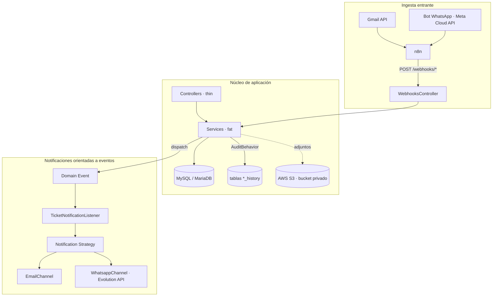

# Mesa de Ayuda

> Plataforma corporativa de mesa de ayuda con **ingesta omnicanal de tickets** y una **arquitectura orientada a eventos** construida sobre CakePHP 5.

Convierte correos de Gmail y mensajes de WhatsApp en tickets accionables, notifica al equipo por múltiples canales de forma desacoplada y mantiene una auditoría completa de cada cambio. Diseñada con tipado estricto, separación clara de responsabilidades y resiliencia de primera clase en cada llamada saliente.

[](https://www.php.net)
[](https://cakephp.org)
[](https://www.mysql.com)
[](https://phpunit.de)
[](https://www.docker.com)
[](https://aws.amazon.com/s3/)
[](https://n8n.io)
[](https://developers.facebook.com/docs/whatsapp)
[](LICENSE)

---

## Tabla de contenidos

- [Características destacadas](#características-destacadas)
- [Arquitectura](#arquitectura)
- [Stack técnico](#stack-técnico)
- [Integraciones](#integraciones)
- [Requisitos](#requisitos)
- [Instalación local](#instalación-local)
- [Despliegue con Docker](#despliegue-con-docker)
- [Configuración](#configuración)
- [Testing](#testing)
- [Comandos útiles](#comandos-útiles)
- [Estructura del proyecto](#estructura-del-proyecto)
- [Convenciones y estándares](#convenciones-y-estándares)
- [Documentación de referencia](#documentación-de-referencia)

---

## Características destacadas

- **Ciclo de vida completo del ticket** — creación, asignación por agente, seguidores, etiquetado, comentarios y transiciones de estado, con predicados de dominio que centralizan la lógica de negocio.
- **Ingesta omnicanal** — los correos de Gmail y los mensajes de WhatsApp se transforman automáticamente en tickets mediante webhooks orquestados por n8n. El truncado UTF-8 y seguro para HTML preserva la integridad del contenido entrante.
- **Notificaciones orientadas a eventos** — los servicios publican eventos de dominio (`TicketCreated`, `TicketAssigned`, `TicketStatusChanged`…) y un *listener* los enruta a los canales adecuados. Añadir un canal o un tipo de notificación no toca los controladores.
- **Doble integración WhatsApp** — bot conversacional entrante/saliente vía Meta Cloud API y notificaciones transaccionales al equipo de soporte vía Evolution API, cada una con su propósito y credenciales.
- **Resiliencia HTTP integrada** — toda llamada saliente (WhatsApp, n8n, Gmail) pasa por un cliente con **Circuit Breaker + Retry** con backoff exponencial, configurable por entorno.
- **Auditoría inmutable** — cada mutación de una entidad operativa deja rastro en su tabla `*_history` a través de `AuditBehavior`.
- **Almacenamiento privado en S3** — adjuntos y fotos de perfil viven en un bucket privado y se sirven mediante URLs presignadas de vida corta, nunca incrustadas en el HTML almacenado.
- **Panel de administración** — configuración del sistema, plantillas de email y credenciales de integración gestionadas en caliente desde `/admin`, con cifrado en reposo de los campos sensibles.

---

## Arquitectura

El sistema sigue un patrón **fat-service / thin-controller**: los controladores son delgados y delegan en servicios, donde reside la lógica de negocio. Las notificaciones e integraciones se desacoplan mediante **eventos de dominio** despachados sobre el `EventManager` global.



**Capas:**

| Capa | Responsabilidad |
|---|---|
| `Controller/` | Capa HTTP delgada. Los flujos de UI compartidos viven en `Controller/Trait/`. |
| `Service/` | Lógica de negocio. Mixins reutilizables en `Service/Traits/`; DTOs inmutables en `Service/Dto/`. |
| `Domain/` | Eventos de dominio y primitivas. Los predicados de estado del ticket centralizan la lógica de negocio. |
| `Notification/` | Adaptadores de canal (`Channel/`), estrategias por evento (`Strategy/`) y renderizado de email. |
| `Model/` | ORM de CakePHP (`Table/`, `Entity/`) y `Behavior/AuditBehavior`. |

**Reglas de los eventos de dominio:** los *payloads* transportan solo IDs; el *listener* recarga los agregados desde la base de datos y captura cualquier `Throwable` sin dejar que se propague al despachador.

---

## Stack técnico

- **Backend:** CakePHP 5.3, PHP 8.5+
- **Frontend:** plantillas server-side (`.php`), CSS con sistema de tokens, JavaScript vanilla
- **Base de datos:** MySQL 8.x / MariaDB
- **Autenticación:** `cakephp/authentication` (Form + Session)
- **Migraciones:** `cakephp/migrations` (fuente de verdad del esquema)
- **Google API:** `google/apiclient` (ingesta Gmail)
- **Almacenamiento:** `aws/aws-sdk-php` (S3 privado)
- **Sanitización HTML:** `ezyang/htmlpurifier`
- **Caché:** `symfony/cache`
- **Infraestructura:** Docker (Nginx + PHP-FPM en una sola imagen)
- **Calidad:** PHPUnit 13, PHPStan, CakePHP CodeSniffer

---

## Integraciones

| Integración | API | Propósito |
|---|---|---|
| **Gmail** | Gmail API | Importación de correos como tickets, lectura de adjuntos y mapeo de hilos. Disparada por n8n vía `POST /webhooks/gmail/import`. |
| **n8n** | Webhooks | Orquestación de automatizaciones externas: clasificación, etiquetado (`POST /webhooks/tickets/{id}/tags`) e ingesta. |
| **WhatsApp — Bot** | Meta Cloud API | Conversación entrante/saliente gestionada en n8n; los mensajes entran vía `POST /webhooks/whatsapp/import`. |
| **WhatsApp — Notificaciones** | Evolution API | Avisos transaccionales al equipo de soporte (ticket creado), gestionados en el backend. |

> **Dos integraciones WhatsApp por diseño.** El bot conversacional (Meta Cloud API) y las notificaciones al equipo (Evolution API) resuelven casos de uso distintos y mantienen credenciales separadas en `system_settings`.

---

## Requisitos

- **PHP 8.5+** con las extensiones: `intl`, `mbstring`, `pdo_mysql`, `openssl`, `curl`, `zip`
- **Composer** 2.x
- **MySQL** 8.x o **MariaDB** 10.5+
- **Docker** y Docker Compose (opcional, recomendado para producción)
- Cuenta **AWS** con un bucket S3 privado (almacenamiento de adjuntos)

---

## Instalación local

```bash
# 1. Instalar dependencias
composer install

# 2. Configurar el entorno
cp config/app_local.example.php config/app_local.php
# Editar credenciales de base de datos, SECURITY_SALT y claves de API

# 3. Aplicar migraciones
bin/cake migrations migrate

# 4. Levantar el servidor de desarrollo
bin/cake server
# Disponible en http://localhost:8765
```

---

## Despliegue con Docker

El `Dockerfile` construye una imagen única (Nginx + PHP-FPM) usada por el servicio **`app`** definido en `docker-compose.yml`, expuesto en el puerto **`8082`** del host.

```bash
docker compose up -d --build
```

> **La base de datos no está incluida** en el `docker-compose.yml`. Debe proveerse externamente (instancia gestionada, MySQL en el host o un contenedor independiente) y referenciarse mediante `DB_HOST`.

La ingesta de Gmail se dispara desde n8n vía `POST /webhooks/gmail/import`; el comando `bin/cake import_gmail` se conserva para depuración manual. El endpoint **`/health`** valida Nginx, PHP-FPM y la conectividad con la base de datos para los *healthchecks* de Docker.

---

## Configuración

La configuración base vive en `config/app_local.php` (ignorado por Git). Opcionalmente puede usarse un archivo `config/.env`, cargado por `josegonzalez/dotenv` desde `config/bootstrap.php`.

### Variables de entorno

| Variable | Descripción |
|---|---|
| `DB_HOST`, `DB_DATABASE`, `DB_USERNAME`, `DB_PASSWORD` | Conexión a base de datos |
| `SECURITY_SALT` | Salt para CSRF y cifrado |
| `FULL_BASE_URL` | URL pública absoluta del sitio |
| `TRUST_PROXY` | Habilitar cuando hay un proxy reverso al frente |
| `AWS_ACCESS_KEY_ID`, `AWS_SECRET_ACCESS_KEY` | Credenciales IAM (permisos mínimos: `s3:PutObject`, `s3:GetObject`, `s3:DeleteObject` sobre el bucket) |
| `AWS_REGION` | Región del bucket (ej. `us-east-1`) |
| `S3_BUCKET` | Nombre del bucket privado |
| `RESILIENCE_CB_THRESHOLD` | Fallos consecutivos antes de abrir el Circuit Breaker (default `5`). Rollback de emergencia: `999999`. |
| `RESILIENCE_CB_COOLDOWN` | Segundos en estado `OPEN` antes de probar `HALF_OPEN` (default `30`). |
| `RESILIENCE_RETRY_ATTEMPTS` | Intentos máximos por llamada HTTP saliente (default `3`). |
| `RESILIENCE_RETRY_BASE_MS` | Delay base del backoff exponencial en ms (default `200`). |

### Almacenamiento de archivos (AWS S3)

Los adjuntos de tickets y las fotos de perfil se guardan en un bucket privado de S3 (con Block Public Access activado) y se sirven mediante rutas estables de la aplicación (`/attachments/view/{id}`, `/profile-images/view/{id}`) que redirigen 302 a URLs presignadas de vida corta. En desarrollo se usa un bucket separado con las mismas variables.

### Resiliencia HTTP

Las llamadas HTTP salientes (WhatsApp, n8n, Gmail) usan Circuit Breaker + Retry vía `App\Service\Resilience\ResilientHttpClient`. El estado del breaker se persiste en el caché `resilience`; **en producción este caché debe usar un backend compartido entre workers (File o Redis), nunca `Array`**.

### Ajustes por tenant

Los tokens OAuth de Gmail, las credenciales de integración y las plantillas de email se gestionan desde `/admin` y se persisten en las tablas `system_settings` y `email_templates`, con cifrado en reposo de los campos sensibles.

---

## Testing

El proyecto incluye una suite de **pruebas unitarias con PHPUnit 13** en `tests/TestCase`, centrada en la lógica de dominio, los servicios y los *traits* de la capa de servicio (resiliencia, notificaciones, eventos de dominio, ingesta Gmail, S3, autenticación y más).

```bash
# Ejecutar toda la suite
composer test

# Cobertura en HTML (salida en coverage/)
composer test-coverage

# Una sola clase o archivo
vendor/bin/phpunit --filter TicketTest
vendor/bin/phpunit tests/TestCase/Service/TicketIngestionServiceTest.php

# Análisis estático
vendor/bin/phpstan analyse src
```

> Las pruebas son unitarias puras (sin *fixtures* del ORM por defecto). Al añadir pruebas de integración que toquen la base de datos, cablea los *fixtures* necesarios en lugar de *mockear* la capa Table.

---

## Comandos útiles

```bash
# Calidad de código
composer cs-check          # Verifica estilo (CakePHP CodeSniffer)
composer cs-fix            # Corrección automática
vendor/bin/phpstan analyse src

# Migraciones
bin/cake migrations migrate
bin/cake migrations status
bin/cake bake migration CreateFooTable

# Ingesta e integraciones
bin/cake import_gmail --max 5   # Importación puntual para depuración
bin/cake test_email             # Verifica configuración de envío

# Servidor de desarrollo
bin/cake server                 # http://localhost:8765
```

---

## Estructura del proyecto

```
src/
├── Controller/          # Capa HTTP delgada
│   ├── Admin/           # Prefijo /admin (Settings, EmailTemplates, Tags…)
│   ├── Component/
│   └── Trait/           # Flujos de UI compartidos entre módulos de tickets
├── Service/             # Lógica de negocio
│   ├── Auth/            # Políticas de sesión y autorización
│   ├── Dto/             # DTOs inmutables (SystemConfig…)
│   ├── Gmail/           # Ingesta y manejo de errores de Gmail
│   ├── Resilience/      # Circuit Breaker + Retry (ResilientHttpClient)
│   ├── Renderer/
│   ├── Traits/          # Mixins reutilizables (config, adjuntos, cifrado…)
│   └── Util/
├── Domain/
│   └── Event/           # Eventos de dominio (TicketCreated, TicketAssigned…)
├── Notification/
│   ├── Channel/         # EmailChannel, WhatsappChannel
│   ├── Strategy/        # Estrategias por evento → NotificationMessage
│   └── Email/           # Renderizado y plantillas de email
├── Listener/            # TicketNotificationListener (EventManager global)
├── Model/
│   ├── Table/           # ORM de CakePHP
│   ├── Entity/          # Entidades + predicados de dominio
│   └── Behavior/        # AuditBehavior → tablas *_history
├── Constants/           # TicketConstants, RoleConstants, SettingKeys…
├── Command/             # CLI: import_gmail, test_email
├── Html/                # Política del sanitizador HTML
└── View/                # AppView, Cells y Helpers

config/
├── Migrations/          # Fuente de verdad del esquema de BD
├── routes.php           # Mapa de rutas (/, /admin, /webhooks/*, /health)
└── app_local.example.php

templates/               # Vistas server-side por controlador
docker-compose.yml       # Servicio único `app` (Nginx + PHP-FPM)
Dockerfile               # Imagen Nginx + PHP-FPM
```

---

## Convenciones y estándares

- **Tipado estricto:** `declare(strict_types=1);` obligatorio en todos los archivos PHP.
- **Sin magic strings:** estados y transiciones de ticket en `TicketConstants`, roles en `RoleConstants`, claves de settings en `SettingKeys`.
- **Notificaciones desacopladas:** nunca se llama a `EmailService`, `WhatsappService` ni a un canal directamente desde controladores o servicios — se publica un evento de dominio y el *listener* despacha.
- **HTML seguro:** todo cuerpo de correo pasa por `HtmlSanitizerTrait` (htmlpurifier) antes de renderizar o almacenar.
- **Auditoría explícita:** los servicios registran los cambios vía `TicketHistoryLoggerTrait`; `changed_by` es `NULL` para mutaciones iniciadas por el sistema.
- **Contadores del sidebar:** centralizados en `SidebarCountsService`; no se consultan tablas de tickets desde las vistas.
- **Sistema de diseño:** todas las variables CSS viven en `webroot/css/styles.css :root`; nunca se hardcodean colores, espaciados ni radios. `docs/design/DESIGN.md` es la fuente única de los componentes.
- **Antes de cada commit:**

  ```bash
  composer cs-fix && composer cs-check
  ```

---

## Documentación de referencia

- [`docs/design/DESIGN.md`](docs/design/DESIGN.md) — sistema de diseño (tokens, componentes, reglas).
- [`docs/operations/n8n-gmail-webhook.md`](docs/operations/n8n-gmail-webhook.md) — cableado del webhook de importación de Gmail.
- [`docs/operations/gmail-oauth-setup.md`](docs/operations/gmail-oauth-setup.md) — configuración de OAuth para Gmail.
- [`docs/audits/`](docs/audits/) — auditorías que guían la dirección del refactor (eventos de dominio, predicados, limpieza de código muerto).

---

<div align="center">
<sub>Construida con tipado estricto, arquitectura modular orientada a eventos y separación clara de responsabilidades.</sub>
</div>
